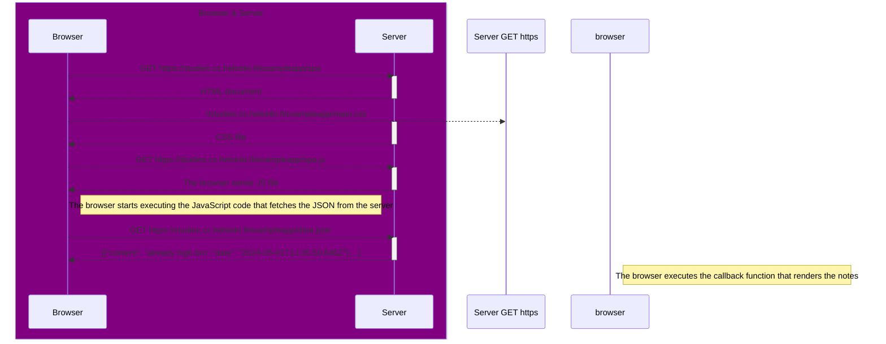
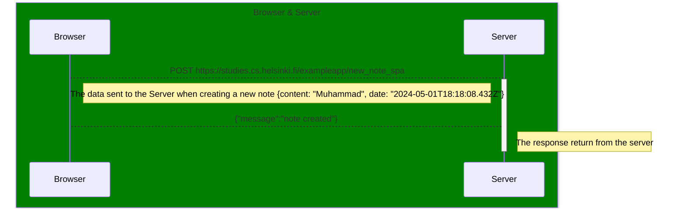

# exercise 0.5: Single page app diagram

```mermaid
sequenceDiagram
    box Purple Browser & Server
    participant Browser
    participant Server
    end

    Browser-->>Server: GET https://studies.cs.helsinki.fi/exampleapp/spa
    activate Server
    Server-->>Browser: HTML document
    deactivate Server

    Browser-->> Server GET https://studies.cs.helsinki.fi/exampleapp/main.css
    activate Server
    Server-->>Browser: CSS file
    deactivate Server

    Browser-->>Server: GET https://studies.cs.helsinki.fi/exampleapp/spa.js
    activate Server
    Server-->>Browser: The browser sends JS file
    deactivate Server

    Note right of Browser: The browser starts executing the JavaScript code that fetches the JSON from the server


    Browser-->>Server: GET https://studies.cs.helsinki.fi/exampleapp/data.json
    activate Server
    Server-->>Browser: [{"content": "already high bro","date": "2024-05-01T13:35:50.646Z"},...]
    deactivate Server

    Note right of browser: The browser executes the callback function that renders the notes
```

# exercise 0.6: Single page app diagram

```mermaid
sequenceDiagram
    box Green Browser & Server
    participant Browser
    participant Server
    end

    Browser-->Server: POST https://studies.cs.helsinki.fi/exampleapp/new_note_spa
    activate Server
    Note right of Browser: The data sent to the Server when creating a new note {content: "Muhammad", date: "2024-05-01T18:18:08.432Z"}
    Server--> Browser: {"message":"note created"}
    Note right of Server: The response return from the server
    deactivate Server
```
